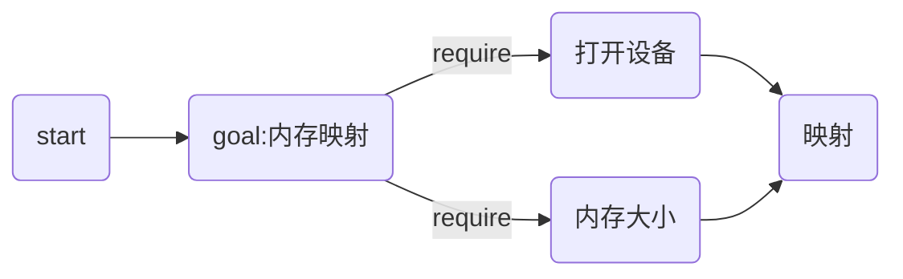
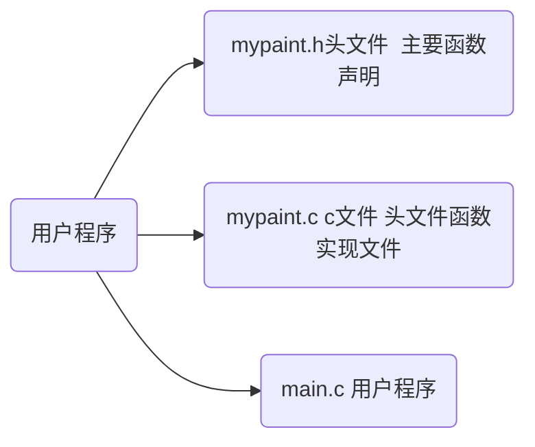
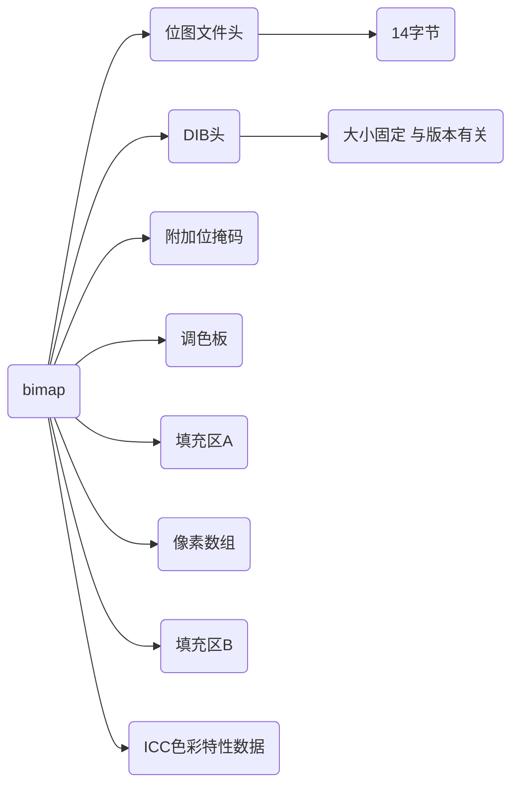

### Embedded system 实验二

#### 图形用户接口


##### 171180616 郭成伟 NJUEE

[TOC]

-------

#### 背景介绍

图形用户接口，又称图形用户界面，是指采用图形的方式显示计算机的用户操作界面。

相较于普通的通过键盘输入文本或字符命令来完成例行任务的字符界面，有许多优点。

- 人机交互性
- 美观性
- 实用性
- 技术性

#### 实验平台

- BeagleBone black 开发板一块 arm架构

- 显示屏一块

  

#### Frame buffer 介绍

帧缓冲是Linux系统为设备提供的一个接口，通过这个接口，将具体的显示缓冲区抽象化，用户不需要关注图像硬件的底层差异，也不必关心物理显示缓冲区的具体位置。它能够模仿显卡的功能，将显卡硬件结构抽象为一系列的数据结构，可以通过framebuffer的读写直接对显存进行操作。

用户可以将framebuffer看成是显存的一个映像，将其映射到进程空间后，就可以直接进行读写操作，写操作会直接反映在屏幕上。这种机制把屏幕上的每个点映射成一段线性内存空间，程序可以简单的改变这段内存的值来改变屏幕上某一点的颜色。

帧缓冲设备为标准的字符型设备，在Linux中主设备号29，

次设备号定义帧缓冲的个数，最大允许有32个设备。

​      `0 = /dev/fb0 第一个fb 设备`
​      `1 = /dev/fb1 第二个fb 设备`


由上所述，Frame Buffer 把屏幕上的每个点映射成一段线性内存空间，所以这部分缓存的大小与屏幕的大小有关。此外缓存的大小还与屏幕的显示方式有关。显示屏有单/双屏模式。单屏模式表示屏幕的显示范围是整个屏幕，这种显示模式只需要一个 Frame Buffer来存储整个屏幕的显示内容。双屏模式则将整个屏幕划分为两部分，它有别于将两个独立的显示屏组织成一个显示屏；单看其中一部分，它们的显示方式是与单屏模式一致的，且两部分同时扫描，工作方式互相独立； 这两部分都各自有 Frame Buffer，且它们的地址无需连续（即下半部的 Frame Buffer 的首地址无需紧跟在上半部的地址末端），并且同时具有独立的两个通道将 Frame Buffer 的数据传输到显示屏上。 

线性的映射方式如下：

从左到右逐点像素扫描，知道扫描到右下角，再折反到左上角的$Z$型路径。Frame Buffer 里的数据是按地址递增的顺序被提取，当 Frame Buffer 里的最后一个字节被提取后， 再返回到 Frame Buffer 的首地址。

- 屏幕同一行上相邻的两个像素被映射到 Frame Buffer 里是连续的。
- 某一行的最末像素与其下一行的首像素反映在 Frame Buffer 里也是连续的。
- 屏幕上最左上角的像素对应 Frame Buffer 的第一单元空间。
- 最右下角的像素对应于 Frame Buffer 的最后一个单元空间。 

本次实验实现单屏模式。


#### LCD控制器

LCD控制器负责从帧缓冲区里提取数据，进行处理并传输到显示屏上。

处理器内部集成LCD控制器，将帧缓冲区里的数据传输到LCDC内部，经过处理输出数据到LCD的输入引脚上。

可以通过命令`fbset`看到设备的一些信息。

我们使用的显示屏基本信息如下：

- $1024\times768$ 分辨率 `16：9`

- $565$ 16位色、无$Alpha$通道

  

#### 色彩

计算机显示器通过RGB值来显示颜色。如果要在屏幕上的点显示某一种颜色，我们需要指定帧缓冲中对应地址的RGB值。值得一提的是，帧缓冲中并不直接存储RGB值，而是存储调色板的索引。

RGB信息通常由红、绿、蓝各8位组成，共24位，这种构成方式也称作“真彩色”。

我们使用的显示器是16位的。由于人眼对这三种颜色的敏感度不同，采用的是$RGB(565)$，所以我们在程序中需要对输入的24位色进行处理。


基本介绍结束。

-------


显示应用的基本结构如下：


现代比较流行的方法是通过$OpenGL$库进行绘图。本次实验我们直接对显存操作，从而实现绘图。


*程序设计逻辑*



#### Target:内存大小

系统调用`ioctl()`可以获得帧缓冲设备的特性。

##### `ioctl()`

与该函数相关的头文件为：`<unistd.h>`

函数原型如下

```c
int ioctl(int fd，ind cmd，…)，
```

该函数的运行逻辑如图：


*fd*通过内核后找到对应的inode和file结构体指针并传给驱动函数，

*cmd*就是一个操作数，如果应用层传来的数值在驱动中有对应的操作。可把和网络相关的请求划分为 6 类：套接口操 作、文件操作、接口操作、ARP 高速缓存操作、路由表操作、流系统。本次实验属于文件操作。

与我们有关的可选参数有以下两个

- **FBIOGET_FSCREENINFO**

  用于获取设备的固定参数，包括缓冲区大小、设备尺寸

- **FBIOGET_VSCREENINFO**

  用于获取设备可变信息，包括可视分辨率、虚拟分辨率、色彩位、扫描时钟等等。

返回值*int*：若成功则返回 0；若出错则返回-1。


本实验中我们想要得到信息的相关的两个结构体分别为：

``` c
struct fb_fix_screeninfo finfo{
	char id[16]; //屏幕的名称
    unsigned long smem_start; // framebuffer在物理内存中的开始地址
    __u32 smem_len; //长度 
    __u32 type; // frambuffer类型 
    __u32 visual; // 设备颜色信息 
    __u32 line_length; // 一行的字节数 
    unsigned long mmio_start; //寄存器映射在物理内存中的开始地址 
    __u32 mmio_len; // 寄存器映射占用物理内存长度
    ... //只列出部分重要的
};

struct fb_var_screeninfo vinfo{
    __u32 xres; //横向分辨率
   	__u32 yres;//纵向
    __u32 bits_per_pixel; //每个像素的显存空间位数
    struct fb_bitfield red; //颜色相关信息 R 
    struct fb_bitfield green;//颜色相关信息 G
    struct fb_bitfield blue;//颜色相关信息 B
    __u32 activete; //激活状态
    ... //列出部分重要的
};
// 颜色表示方式 结构体
struct fb_bitfield{
    __u32 offset; // 偏移位数
	__u32 length; //占用位数
    __u32 msb_right;//符号位方式：是否在最右
};
```

由上述帧缓冲线性映射介绍，结合vinfo结构，可以得到帧缓冲的大小。

**帧缓冲大小如下计算：**
$$
FrameBufferSize=\frac{Width\times Height\times Bit\_per\_Pixel}{8}
$$

#### Target:映射

##### 函数`mmap()`

头文件`<sys/mman.h>`,函数原型如下

``` c
void* mmap(void* start,size_t length,int prot,int flags,int fd,off_t offset);
```

`mmap()`是一种内存映射文件的方法，即将一个文件或者其它对象映射到进程的地址空间，实现文件磁盘地址和进程虚拟地址空间中一段虚拟地址的一一对映关系。实现这样的映射关系后，进程就可以采用指针的方式读写操作这一段内存，而系统会自动回写页面到对应的文件磁盘上，即完成了对文件的操作而不必再调用`read`,`write`等系统调用函数。相反，内核空间对这段区域的修改也直接反映用户空间，从而可以实现不同进程间的文件共享。如下图所示：


参数解释如下：

返回值：若映射成功则返回映射区的**内存起始地址**，否则返回 -1。

参数 `start`：指向要映射的内存起始地址，通常设为 NULL，代表让系统自动选定地址，映射成功后返回该地址。 

参数 `length`：代表将文件中映射到内存的长度。 

参数 `prot`：表示映射区域的保护方式。

- PROT_READ (可读)
- PROT_WRITE (可写）
- PROT_EXEC (可执行)
- PROT_NONE (不可访问）

参数 `flags`：影响映射区域的各种特性。

- MAP_SHARED 对映射区域的写入数据会复制回文件内，而且允许其他映射该文件的进程共享。
- MAP_PRIVATE 对映射区域的写入操作会产生一个映射文件的复制，即私人的“写入时复制” ，对此区域作的任何修改都不会写回原来的文件内容。

-  MAP_ANONYMOUS 建立匿名映射。此时会忽略参数 fd，不涉及文件，而且映射区域无法和其他进程共享。 

- MAP_DENYWRITE 只允许对映射区域的写入操作，其他对文件直接写入的操作将被拒绝。
- MAP_LOCKED 将映射区域锁定住，这表示该区域不会被置换（swap）。

 参数 `fd`：要映射到内存中的文件描述符。如果使用匿名内存映射时，即 flags 中设置了 MAP_ANONYMOUS，fd 设为-1。 

参数 `offset`：文件映射的偏移量，通常设置为 0，代表从文件最前方开始对应，offset 必须是分页大小的整数倍

按页映射，不足一页则补足一页。


##### 函数 `munmap`

函数原型:

``` c
int munmap( void * addr, size_t len ) 
//返回值： 成功返回 0， 失败返回 -1
// addr 调用 mmap()时返回的地址，
// len  映射区的大小
```

该调用在进程地址空间中解除一个映射关系，当映射关系解除后，对原来映射地址的访问将导致段错误发生。


#### Target：设备文件的打开和关闭

在Linux操作系统中，我们对设备的操作有这么一句话：一切设备皆文件。我们对显示器的设备操作，本质上还是一个文件操作。

##### `open()` 函数

定义在`<fcntl.h>`中

``` c
//函数原型
open(const char *pathname, int flags,...);

//实际使用
int fd = open("/dev/fb0",O_RDWR);
```

返回值：成功则返回文件描述符，失败返回 -1；

参数 flags: 用于指定文件的打开、创建模式。

 一个或者多个常量进行“或”运算，构成falgs

常用的如下：

- O_RDONLY 只读模式
- O_WRONLY 只写模式
- O_RDWR 读写模式

以上这三个常量，必须制定一个且只能指定一个。

此外还有一些。

- O_CREAT:    若文件不存在，则创建它，需要使用mode选项。来指明新文件的访问权限

- O_APPEND:   追加写，如果文件已经有内容，这次打开文件所写的数据附加到文件的末尾而不覆盖原来的内容

##### `close() `函数

```c
int close(int fd)
//参数说明：
//fd：是需要关闭的文件描述符
```


--------

#### 函数库 

在我们对framebuffer 进行映射结束之后，显示器文件内存被映射到用户空间，此外我们还需要在用户空间提供一些函数供给用户使用。

##### 函数设计

```c
void draw_pixel(unsigned char *fbp, int x, int y, char Red, char Green, char Blue){ // 16色RGB 画点函数
  int offset;//由上所述 线性映射规则 容易算出offset
  short color;
  offset =(y * vinfo.xres + x) * vinfo.bits_per_pixel /8;
  color = ((Red>>3) <<11) | (((Green>>2) << 5) & 0x07E0) | ((Blue>>3) & 0x1F);
  *(unsigned char *)(fbp + offset +0) =color & 0xff;
  *(unsigned char *)(fbp + offset +1) =(color >> 8 )& 0xff;
}
```

其中 fbp是映射内存空间的起始位置，offset 为0时，此处则为显示屏上左上角第一个像素的地址。

因为我们的设备是16色RGB函数，所以需要对RGB进行压缩。

在565格式下，掩码为：0xF800、0x07E0、0x001F。用掩码“与”上像素值，从而提取出想要的颜色分量，损失的那些位不予考虑。

有了画点函数后，我们可以复用画点函数，从而实现***画线***，***画矩形***的操作。由于比较简单，在这里就不展示具体函数函数了。

其中可能会用要math数学库，在制作动态库的时候需要注意。


##### 动态库制作以及程序结构




##### 函数库介绍

Linux 系统中有两类函数库，静态函数库和动态函数库。两者的主要区别在于，程序调用函数时，将函数整合到程序中的时机不同：

- 静态函数库在程序编译时就会整合到程序中，程序运行前函数库就已经被加载。这样做的好处是程序运行时不再需要调用外部函数库，可直接执行；缺点也很明显，所有内容都整合到程序中，编译文件会比较大，且一旦静态函数库改变，程序就需要重新编译。
- 动态函数库在程序运行时才被加载，程序中只保存对函数库的指向（程序编译仅对其做简单的引用）。使用动态函数库的好处是，程序生成的可执行程序体积比较小，且升级函数库时无需对整个程序重新编译；缺点是，如果程序执行时函数库出现问题，则程序将不能正确运行。


静态函数库文件扩展名是 `.a`

动态函数库扩展名为 `.so`

目前，Linux 系统中大多数都是动态函数库（主要考虑到软件的升级方便），其中被系统程序调用的函数库主要存放在 "`/usr/lib`" 和 "`/lib`" 中；Linux 内核所调用的函数库主要存放在 "`/lib/modules`" 中。函数库（尤其是动态函数库）的存放位置非常重要，轻易不要做更改。


##### 编译过程


```c
arm-linux-gcc mypaint.c -c  //生成.o可执行文件
arm-linux-gcc -shared -fPIC -o mypaint_lib.so mypaint.o //生成动态链接库 mypaint_lib.so
    //-fPIC是 Position Independent Code 的缩写，表示要生成位置无关的代码，这是动态库需要的特
性。
arm-linux-gcc main.c -o main -L. mypaint_lib.so -lm  
    //链接                    -L. 表明链接库的位置在当前目录下  
                                                 // -lm 表示使用math数学库
```

编译过程中的几个选项

- `-include`
  **-**include **用来包含头文件**，但一般情况下包含头文件都在源码里用#include xxxxxx实现，**-**include参数很少用。

- `-I`参数

  用来指定头文件目录,但是如果头文件不在`/usr/include`里我们就要用`-I`参数指定了。这里可以用相对路径，比如头文件在当前目录，可以用`-I.`来指定。

- `-l`参数

  **指定程序要链接的库**，后面紧接着就是库名，把库文件名的头lib和尾.so去掉就是库名了。如果想要用我们自己写的库，命名的时候需要按照命名规则`lib+name+.so`,并且拷贝到`/usr/lib`目录下，在编译时加上`-lname`就能使用自建库函数了。

- `-L`参数

  如果库文件没放在`/lib`、`/usr/lib`、`/usr/local/lib`里，需要使用`-L参数`

  `-L`参数跟着的是库文件所在的目录名。

  

  在制作完成动态库之后我们把编译完成的可执行文件和`.so`库文件拷贝到开发板上，由于是动态链接，程序运行时，需要提供动态库。

  因为运行时动态库的搜索路径的先后顺序是：

1. 编译目标代码时用`-R`选项指定的运行时（run-time）动态库搜索路径；
2. 环境变量`LD_LIBRARY_PATH`指定的动态库搜索路径； 
3. 配置文件`/etc/ld.so.conf`中指定的动态库搜索路径；
4.  默认的动态库搜索路径`/lib`和`/usr/lib`。

在这里我们把我们的库文件拷贝到`/lib`目录，即可运行

 

##### 一些问题


1. 在调试过程中可能会遇到显示屏无信号的情况，这时候我们需要主动向显示屏发送信号。

   ``` powershell
   mount -t sysfs sys /sys 
   cd /sys/class/graphics/fb0
   echo "Whatever you like" > blank
   ```

2. 绘画结束后，我们可以将映射的空间清零，将显示屏清屏。

   ``` c
   memset(fbp,0,screensize);
   ```

3. 可能会碰到找不到设备`/dev/fb0`的情况，这时候我们需要重新配置内核

   在menuconfig中将以下两项选中：

   `Device Drivers->Graphics support->DRM support for TI LCDC Display Controller` 

   `Device Drivers->Graphics support->I2C encoder or helper chips->NXP semiconductors TDA668X HDMI encoder`

   设置完成后，重新编译载入内核即可。

4. 由于开发板上并没有安装gcc等编译工具，我们选择制作nfs网络文件系统。

   

   NFS是Network File System的缩写即网络文件系统。 它最大的功能就是可以通过网络，让不同的机器、不同的操作系统可以共享彼此的文件。 NFS服务器可以让PC将网络中的NFS服务器共享的目录挂载到本地端的文件系统中，而在本地端的系统中来看，那个远程主机的目录就好像是自己的一个磁盘分区一样，在使用上相当便利；

   在开发板的终端上如下配置：
   
   ``` powershell
   ifconfig eth0 192.168.208.133 #配置开发板的网络
           # 网络设备  # ip
   mount 192.168.208.12:/srv/nfs4 mnt -o nolock,proto=tcp  
   #挂载主机的/srv/nfs4文件夹 到 开发板上的 mnt目录下
   #tcp协议
   									#不开启文件锁
   ```
   
   `-o nolock`文件锁是保持文件同步的一种手段，当多个用户同时操作同一个文件时，文件锁可以保证数据不发生冲突。NFS中的文件锁既可以加在客户端，也可以加在服务器端。如果客户端挂载NFS文件系统时使用了选项nolock，表示在客户端加锁。这种情况下可以保证同一个客户端的多个进程访问同一个文件的过程不发生冲突，但是不同客户端访问同一个文件时还可能发生冲突，因为文件锁加在了客户端，其他客户端不知道这个文件锁的存在。如果客户端挂载NFS文件系统时使用了选项lock，表示在服务器端加锁，这样所有的客户端都可以检查服务器端是否存在文件锁，因此所有客户端访问同一个文件时都不会发生冲突。
   
   
   
5. 运行程序后发现画出来的圆并不是圆而是椭圆，发现是显示器拉伸成了$16:9$的比例，在显示器（硬件）设置中可以替换成$4:3$，设置完成后显示正常。

   

--------


#### 进阶：bmp图像读取

整个bmp文件的读取过程与思路与之前所作`fat12`文件读取比较类似。

##### bitmap介绍

**BMP**取自位图**B**it**m**a**p**的缩写，也称为**DIB**（与[设备](https://zh.wikipedia.org/wiki/设备)无关的**位图**），是一种独立于[显示器](https://zh.wikipedia.org/wiki/显示器)的[位图](https://zh.wikipedia.org/wiki/位图)[数字图像](https://zh.wikipedia.org/wiki/数字图像)文件格式。图像通常保存的[颜色深度](https://zh.wikipedia.org/wiki/颜色深度)有2（1位）、16（4位）、256（8位）、65536（16位）和1670万（24位）种颜色。8位图像除了可以是索引彩色图像外，也可以是灰阶图像。表示[透明](https://en.wikipedia.org/wiki/transparency_(graphic))的[alpha通道](https://zh.wikipedia.org/wiki/Alpha通道)也可以保存在一个类似于[灰阶](https://zh.wikipedia.org/wiki/灰階)图像的独立文件中。

BMP文件通常是不[压缩](https://zh.wikipedia.org/wiki/图像压缩)的，所以它们通常比同一幅图像的压缩图像文件格式要大很多。根据颜色深度的不同，图像上的一个像素可以用一个或者多个字节表示，它由**n/8**所确定（n是位深度，1字节包含8个数据位）。图片浏览器等基于字节的[ASCII](https://zh.wikipedia.org/wiki/ASCII)值计算像素的颜色，然后从调色板中读出相应的值。





由于思路一致，我们在这里只分析位图文件头与DIB头的结构。二进制数据均以小端序排序。

``` c
struct Bmp_Header{//14字节
    u16 type;//用于标识BMP和DIB文件的魔数，一般为0x42 0x4D，即ASCII的BM
    u32 size;//BMP文件的大小（单位为字节）
    u16 Reserved_1;//保留；实际值因创建程序而异
    u16 Reserved_2;//保留；实际值因创建程序而异
    u32 offset;//位图数据（像素数组）的地址偏移，也就是起始地址。    
};
```

``` c
struct DIB_Header{ //该版本为40字节
    u32 _size;//该头结构的大小（40字节）
    u32 width;//位图宽度，单位为像素（有符号整数）
    u32 height;//位图高度，单位为像素（有符号整数）
    u16 Num_of_color_planes;//色彩平面数；只有1为有效值
    u16 colour_bit;//每个像素所占位数，即图像的色深。典型值为1、4、8、16、24和32
    u32 Com_type;//所使用的压缩方法
    u32 size_of_p;//图像大小。指原始位图数据的大小（详见后文），与文件大小不是同一个概念。
    u32 PixelPRow;//图像的横向分辨率，单位为像素每米（有符号整数）
    u32 PixelPCol;//图像的纵向分辨率，单位为像素每米（有符号整数）
    u32 NOColor;//调色板的颜色数，为0时表示颜色数为默认的2色深个
    u32 NOfkeyColor; //重要颜色数，为0时表示所有颜色都是重要的；通常不使用本项
};
```

读出offset之后，就可以找到数据开头

##### 几个需要注意的点

- bmp文件的像素数组模式

  这部分逐个像素表示图像。每个像素使用一个或者多个字节表示。

  通常，像素是从下到上、从左到右保存的。但如果使用的不是BITMAPCOREHEADER，那么未压缩的Windows位图还可以从上到下存储，此时图像高度为负值。

  每一行的末尾通过填充若干个字节的数据（可以填充任意值，并非一定是0值）使该行的长度为4字节的倍数。像素数组读入内存后，每一行的起始地址必须为4的倍数。这个限制仅针对内存中的像素数组，针对存储时，仅要求每一行的大小为4字节的倍数，对文件的偏移没有限制。

  例如：对于24位色的位图，如果它的宽度为1像素，那么除了每一行的数据（蓝、绿、红）需要占3字节外，还会填充1字节；而如果宽为2像素，则需要2字节的填充；宽为3像素时，需要3字节填充；宽为4像素时则不需要填充。

- bmp数据区小端模式

  由于是小端模式，所以在读取的时候，颜色的结构应为：

  ```c
  struct Color{//24位
     unsigned char b;
     unsigned char g;
     unsigned char r;
  };
  ```

- bmp文件的大小与显示器的分辨率的冲突

  在实际情况中，我们常常需要显示一些比显示器分辨率更大的图片。若直接一一对应，那么会遇到显存空间不足的情况。简单的处理是直接对图像进行裁剪，在这里由于时间问题，我们也是采取这样的方案。或者可行的方案是对高分辨率的图像进行采样（对低分辨率的图像如果想全屏显示，也可以进行双线性插值）。


##### 一个bug

在实际运行中，发现所写的显示程序描绘的图像的颜色有问题：


我们可以观察到，图片的细节都保留了，但是图像的色彩发生了变化。

在排除各项问题后，发现是动态库画点函数颜色处理不当。在进行24位色转化成16位色的过程中，一开始舍去了高位的信息，从而导致颜色与现实相差巨大。

保留高位后，显示效果良好。

```c
void draw_pixel(unsigned char *fbp, int x, int y, char Red, char Green, char Blue){ // 16色RGB 画点函数
///...
  color = ((Red>>3) <<11) | (((Green>>2) << 5) & 0x07E0) | ((Blue>>3) & 0x1F);
//....
}
```


至此，图形用户接口显示器实验结束。