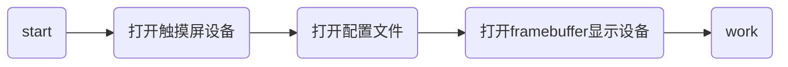
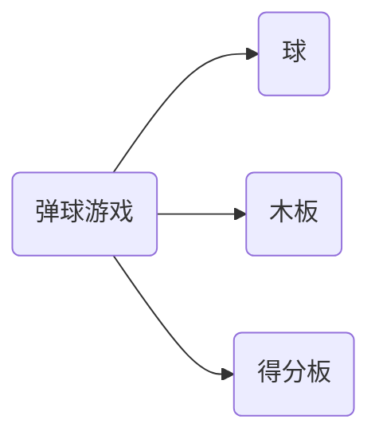

### Embedded system 实验四

#### 触摸屏移植：`tslib`库移植

##### 171180616 郭成伟

[TOC]

-------

#### 背景介绍

触摸屏技术是一种新型的人机交互输入方式，与传统的键盘和鼠标输入方式相比，触摸屏输入更直观。 触摸屏由触摸检测部件和触摸屏控制器组成，触摸检测部件安装在显示器屏幕前面，用于检测用户触摸位置，然后将相关信息传送至触摸屏控制器;而触摸屏控制器的主要作用是从触摸点检测装置上接收触摸信息，并将它转换成触点坐标，再传送给CPU。它同时能接收CPU发来的命令并加以执行。

从现在的趋势上来看，各种类型的设备都在逐渐的加上触摸显示屏，比如手机、相机等等，应用范围不可谓不广大。

在采用触摸屏的移动终端中，触摸屏性能的调试是个重要问题之一，因为电磁噪声的缘故，触摸屏容易存在点击不准确、有抖动等问题。

`tslib`是一个开源的程序，能够为触摸屏驱动获得的采样提供诸如滤波、去抖、校准等功能，通常作为触摸屏驱动的适配层，为上层的应用提供了一个统一的接口。

我们这个实验实现`tslib`的移植与再开发。


#### 实验平台

- BeagleBone black 开发板一块 
- IPS触摸显示屏一块


#### 触摸屏原理简介

常用的触摸屏一般有电阻屏和电容屏：电阻屏是在触摸点被按压时，上下两层导电层接触，在x和y方向形成电阻分压，通过 A/D 传感器采样电压得出按压点坐标，因而一般只支持单点触控；电容屏是利用人体电容和 触摸屏触摸板形成耦合使电流变化，通过 A/D 采样四个角的电流比例得到触摸点的位置，可以支持多点触控，是主流智能手机的标配。 Linux 内核包含多种触摸屏设备驱动，可以为多种触摸屏提供支持。无论采用何种传感原理, 最终都要通过A/D 转换器变成数字量进行分析计算。Linux 系统内核中完成A/D 转换部分, 而触摸屏库则给应用程序提供方便的接口。

#### 移植安装

##### 内核设置

在内核中，我们要开启与触摸屏相关的功能。具体配置目录为：
`Device Drivers--> HID support--> Special HID drivers--> HID Multitouch panels` 

`Device Drivers-->Input device support -->Event interface`

其中第一项是开启多点触控的功能，第二项是关于触摸屏所使用到的设备文件。

配置完成之后，重新载入系统，如果没有别的错误就可以在过系统中找到`/dev/input/eventX`文件。`tslib`库依赖这个设备文件存取。


##### 移植

我们使用的是交叉编译，关于交叉编译的部分可以在实验一实验报告中找到。

配置好交叉编译环境变量后，进行以下操作：

1. 下载触摸屏库`tslib-1.0.0.tar.bz2`, 并将其解压到工作目录。

2. 进入解压目录。完成以下操作：

   ``` powershell
   ./ autogen.sh
   ./ configure --host=arm -linux --prefix =/path/to/install
   make
   make install
   ```

3. 完成编译。正确编译后, 会在安装目录下新生成`etc`、`bin`、`lib`、`include` 四个子目录。

   - `etc` 里的`ts.conf` 是库的配置文件
   - `bin`下面的可执行程序包括触摸屏校准和测试工具
   - `lib` 里是触摸屏的动态链接库和模块插件,
   - `include` 下面的`tslib.h`可用于基于触摸屏库的应用程序二次开发。

**一些说明：**

- `--prefix` 选项用于`make install` 的安装目录, 编译完成后会将结果集中存放于此。如果不指定安装目录, 默认的安装目录一般是`/usr/local`, 普通用户没有写权限，此时不宜用`make install` 命令。
- `make` 命令正确完成后, 结果分散在`src/.libs(库)` 和`plugins/.libs (插件)` 中, 可通过手工复制到目标系统。
- 编译过程中可能会有错误提示: `undefined reference to ‘rpl_malloc’`, 可在`configure` 之前设置变量“`export ac_cv_func_malloc_0_nonnull=yes`”。

以上的过程在主机中完成。接下来我们再开发板上操作。

##### 开发板测试

将编译生成的文件夹拷贝至开发板中。这里我们有不同的策略。比较方便的是采用nfs网络文件系统。在第二次实验报告中我们也有提到，在这里我们也不再赘述。

在开发板的终端上如下配置：

``` powershell
ifconfig eth0 192.168.208.133 #配置开发板的网络
# 网络设备 				#ip
mount 192.168.208.12:/srv/nfs4 mnt -o nolock,proto=tcp
#挂载主机的/srv/nfs4文件夹 到 开发板上的 mnt目录下
							#tcp协议
									#不开启文件锁
```

我们只需要将需要传送的文件移至主机`/srv/nfs4`文件夹下，即可以在开发板上的`/mnt`文件夹中找到相应文件（它们是同一个文件，并不是拷贝）。

##### 环境变量设置

将前面产生的文件按目录对应关系分别复制到目标系统的`/usr` 目录中。

- 编辑`ts.conf` 文件, 去掉“# module_raw input” 前面的注释。

- export TSLIB_TSDEVICE=/dev/input/event1
  触摸屏设备文件或Event interface 设备文件。

  `eventX` 的主设备号是13, 次设备号从64 开始,
  可通过`/proc/bus/input/devices` 文件获知触摸屏的次设备号

- export TSLIB_CONFFILE=/etc/ts.conf
  触摸屏库的配置文件。一般需要保留这几个模块:

  - `variance`, 用于过滤AD 转换器的随机噪声。它假定触点不可能移动太快, 其阈值(距离的平方) 由参数delta 指定; 

  - `dejitter`, 去除抖动, 保持触点坐标平滑变化;
  - `linear,` 线性坐标变换。

- export TSLIB_PLUGINDIR=/usr/lib/ts
  插件模块文件(.so) 所在目录。

- export TSLIB_CONSOLEDEVICE=none

  终端设备, 缺省即是`/dev/tty`, 此处不需要。

- export TSLIB_FBDEVICE=/dev/fb0
  帧缓冲设备文件，即调用的是我们第三次实验使用的显示屏设备
- export TSLIB_CALIBFILE=/etc/pointercal
  校准文件。早期触摸屏由于工艺原因, 每台机器的坐标读取数值差异较大, 使用前必须通过校
  准工具将触摸屏和液晶屏坐标进行校准, 产生一个校准文件。


以上准备工作就绪后, 尝试执行/usr/bin/ts_calibrator，完成校准工作。

此后可尝试执行`ts_test`文件，可实现 `draw`、`drag`、`quit`等操作。

#### `ts_test`源程序分析

##### 调色板

``` c
static int palette [] =//调色板相关
{
	0x000000, 0xffe080, 0xffffff, 0xe0c0a0, 0x304050, 0x80b8c0
};
#define NR_COLORS (sizeof (palette) / sizeof (palette [0]))
//提供了几种颜色的rgb 并且通过索引来设置颜色 传入绘图函数的最后一个参数
//调色板

// 截取 设置调色板的代码段
	for (i = 0; i < NR_COLORS; i++)
		setcolor (i, palette [i]);
```

##### 刷新屏幕

``` c
static void refresh_screen () //刷屏 
{
	int i;

	fillrect (0, 0, xres - 1, yres - 1, 0);//用黑色刷新屏幕 并且打印信息和按钮
	put_string_center (xres/2, yres/4,   "TSLIB test program", 1);
	put_string_center (xres/2, yres/4+20,"Touch screen to move crosshair", 2);
	for (i = 0; i < NR_BUTTONS; i++) //打印按钮
		button_draw (&buttons [i]);
}

```

##### 开启设备

``` c
//main() 
// 用于读取触摸屏获取到的按压点的信息。
if( (tsdevice = getenv("TSLIB_TSDEVICE")) != NULL ) {
		ts = ts_open(tsdevice,0); // 最后一位是非零值-->非阻塞模式读取
	} else {						//0 则是阻塞方式读取
		if (!(ts = ts_open("/dev/input/event0", 0)))
			ts = ts_open("/dev/touchscreen/ucb1x00", 0);
}
```

##### 阻塞、非阻塞方式

所谓的阻塞非阻塞，说的是读取触摸屏设备时，如果是阻塞方式则没有触摸数据时会停在该语句处等待触摸。

##### **button**相关

```c
static struct ts_button buttons [NR_BUTTONS];
//button 数据结构
struct ts_button {
	int x, y, w, h;
	char *text;
	int flags;
#define BUTTON_ACTIVE 0x00000001
};

static void button_draw (struct ts_button *button)
{
	int s = (button->flags & BUTTON_ACTIVE) ? 3 : 0;
	rect (button->x, button->y, button->x + button->w - 1,
	      button->y + button->h - 1, button_palette [s]);
	fillrect (button->x + 1, button->y + 1,
		  button->x + button->w - 2,
		  button->y + button->h - 2, button_palette [s + 1]);
	put_string_center (button->x + button->w / 2,
			   button->y + button->h / 2,
			   button->text, button_palette [s + 2]);
}

static int button_handle (struct ts_button *button, struct ts_sample *samp)
{
	int inside = (samp->x >= button->x) && (samp->y >= button->y) &&
		(samp->x < button->x + button->w) &&
		(samp->y < button->y + button->h);//如果触点的坐标在按钮的范围之内

	if (samp->pressure > 0) {
		if (inside) {
			if (!(button->flags & BUTTON_ACTIVE)) {
				button->flags |= BUTTON_ACTIVE;
				button_draw (button);
			}
		} else if (button->flags & BUTTON_ACTIVE) {
			button->flags &= ~BUTTON_ACTIVE;
			button_draw (button);
		}
	} else if (button->flags & BUTTON_ACTIVE) {
		button->flags &= ~BUTTON_ACTIVE;
		button_draw (button);
                return 1;
	}

        return 0;
}
```

**主要工作逻辑**



##### 主要工作循环

``` c
while (1) {//死循环
		struct ts_sample samp;//触点数据
		int ret;

		/* Show the cross */
		if ((mode & 15) != 1)
			put_cross(x, y, 2 | XORMODE);//异或模式

		ret = ts_read(ts, &samp, 1);//读取触点

		/* Hide it */
		if ((mode & 15) != 1)
			put_cross(x, y, 2 | XORMODE);

		if (ret < 0) {
			perror("ts_read");
			close_framebuffer();
			exit(1);
		}

		if (ret != 1)//如果读到了超过一个点则抛弃多余的点
			continue;

		for (i = 0; i < NR_BUTTONS; i++)//处理按钮事件
			if (button_handle (&buttons [i], &samp))
				switch (i) {
				case 0:
					mode = 0;
					refresh_screen ();//刷新屏幕
					break;
				case 1:
					mode = 1;
					refresh_screen ();
					break;
				case 2:
					quit_pressed = 1;//quit
				}

		printf("%ld.%06ld: %6d %6d %6d\n", samp.tv.tv_sec, samp.tv.tv_usec,
			samp.x, samp.y, samp.pressure);//打印对应数据

		if (samp.pressure > 0) {//如果有触点
			if (mode == 0x80000001)//draw模式
				line (x, y, samp.x, samp.y, 2);
			x = samp.x;//刷新坐标
			y = samp.y;//刷新坐标
			mode |= 0x80000000; //保留模式
		} else
			mode &= ~0x80000000;
		if (quit_pressed)
			break;
	}
	close_framebuffer();//关闭fb设备

```

#### 我的程序设计


​																	经典fc弹球游戏图示

我们的设计目标是在原有的ts_test基础上，增加一个新功能：game。点击game后，进入一个fc弹球游戏，该游戏应当可以游玩。游玩逻辑：

- 用户用手指控制底部木板在屏幕上移动。（已实现）

- 小球打到木板后反弹（已实现）
- 若没有打到木板则碰到底部边界则失败。（时间原因 `to be finished`）
- 小球打到得分板后反弹，并且得分板消失，用户得分加上得分板上的数字。（已实现）

##### 程序组成部分



##### 球和球的运动逻辑

``` c
void circle(int x, int y, int r){
     int R = r;
    int theta =0;
    for (theta = 0; theta <360; ++theta){
        int i = x + R * cos(theta);
        int j = y + R * sin(theta);
        pixel(i,j,2);//使用了fbutil.h库中的画点函数，2指绘画颜色为白色
    }
}//使用了数学库math.h 编译时需要加上 -lm选项
```

我们考虑采用全屏刷新的方式实现小球在屏幕上的运动。在外层循环之内，我们再用一层循环用于不断刷屏来产生动态效果。

小球碰到得分板或者边界或者底部木板都会进行反弹。为了节省时间，设定初始时候小球的运动方向是`（1，1）`。

``` c
if(mode == 3){//游戏模式
    ...//省略
	while(sign_inloop){//如果仍处在游戏模式
        ...//省略
       	ret = ts_read(ts, &samp, 1);//非阻塞方式
        //以下是底部木板绘制，设计逻辑见 底部木板 部分
        put_board(samp.x, samp.y, 2 | XORMODE);
		//以下是得分板绘制，设计逻辑见 得分板 部分
		for (int idx =0; idx<4;++idx){
			my_scores_draw(&game_scores[idx]);
		}
        //以下是 按钮处理部分 此段代码和原始提供的类似，详细分析已经在 示例程序分析中																	分析
        for (i = 0; i < NR_BUTTONS; i++)
			if (button_handle (&buttons [i], &samp))
					switch (i) {
								case 0:
									mode = 0;
									sign_inloop=0;//退出游戏模式
									refresh_screen ();
									break;
								case 1:
									mode = 1;
									sign_inloop=0;//退出游戏模式
									refresh_screen ();
									break;
								case 3:
									mode = 3; //game mode
									break;
								case 2:
									sign_inloop=0;//退出游戏模式
					}
    circle(cx,cy,10);//画运动小球 
        //cx，cy初始位置位于屏幕中心，随后不断刷新
        
   	///以下是运动 碰壁部分 只列举一类 并不全部列出
    ///    
    if(cx==xres){ //碰到了容器壁
			Cres = -speed;
		}
    ...//省略
        
    //碰到了得分块
	if(0<cx&&cx<xres/4&&game_scores[0].flags){  //yes		
		if(cy-5==60){
			game_scores[0].flags=0;
			scores += 10; //scores 可以 优化成得分块的属性，这边并没有这么做
			Cyes = speed; 
		}
    }
    //碰到了底部木板
	int tempx = samp.x;
	int tempy = samp.y;     
    if(tempx-50<cx&&cx<tempx+50){
			if(cy+5==tempy){
				Cyes =-speed;
			}
	}   

	cx += Cres;
	cy += Cyes;
        
	refresh_screen_inloop(); //刷新屏幕
        
    }
    ...//省略
}
```

刷新游戏工作区的屏幕，按钮不刷新。

``` c
static void refresh_screen_inloop ()
{
	int i;
	fillrect (0, 50, xres - 1, yres -1, 0);
}
```

##### 底部木板

``` c
void put_board(int x, int y, unsigned int colidx){
  rect(x-50,y-5,x+50,y+5,colidx);
  fillrect(x-50,y-5,x+50,y+5,colidx);
}
```

在实际调用时候使用异或模式，可以实现拖动的效果。

`put_board(samp.x, samp.y, 2 | XORMODE);`

##### 得分板

初始化过程略去，与示例程序类似。

在绘画时候，判断得分板是否存活，存活则绘出：

``` c
static void my_scores_draw (struct ts_button *button)
{
	if(button->flags==1){
		button_draw(button);
	}
}
```

##### Makefile

``` makefile
CC = arm-linux-gcc #交叉编译
PROGRAM = ts_main
OBJ = font_8x8.o font_8x16.o testutils.o fbutils.o #依赖

default : $(PROGRAM) 
ts_main : ts_main.o $(OBJ) 
	$(CC) -o $@ $^  -lts -L /home/student/xxx/lib -lm
%.o : %.c 
	 $(CC) -c $< 
cp :
	cp $(PROGRAM) /srv/nfs4/
```


#### 一些问题

1. 在运行`ts_test`文件时，可能会遇到这样的bug：`./ts_test: error while loading shared libraries: libdl.so.2: cannot open sharedy`

   我们可以在主机上的`arm`相关库文件中找到`libdl.so.2`,移动至开发板上的`/usr/lib`，即可正常运行。

2. 在实际运行游戏时，会出现得分板或者小球不断闪烁的过程，考虑到采用的是**全屏刷新**的策略来提供动态效果，效率比较低。由于嵌入式系统运算资源并不丰富，所以此种方案循环的时间可能会较长，从而导致游戏刷新率不高，产生拖影或者闪烁。


3. 游戏优化方向：

   - 可以使用异或模式绘制小球，这样可以不需要全屏刷新而获得动态功能，这个逻辑实现和`put_cross()`比较类似。可以节省运算资源并且减轻闪烁的现象。
   - 可以增加难度按钮，控制小球移动的速度。
   - 可以完整地实现得分板的随机生成。并且屏幕上增加得分显示（现在的逻辑是结束时打印）。

   不过由于时间原因，并且我们的目标并不是编写一个合格的游戏，笔者并没有继续将这个游戏完善。简陋的实现已经可以帮助我们理解触摸屏相关的逻辑和`tslib`库的开发。

#### 总结

通过本次实验，对触摸屏库`tslib`有了一定的了解，完成了移植工作并基于测试文件进行了弹球游戏的编写，对Linux嵌入式系统开发有了更深的理解。但是由于时间原因，应用程序并没有达到可玩的程度。不过基本目标算是实现了，可以移植一个库到嵌入式设备上并进行再开发。

至此，最后一次试验结束。